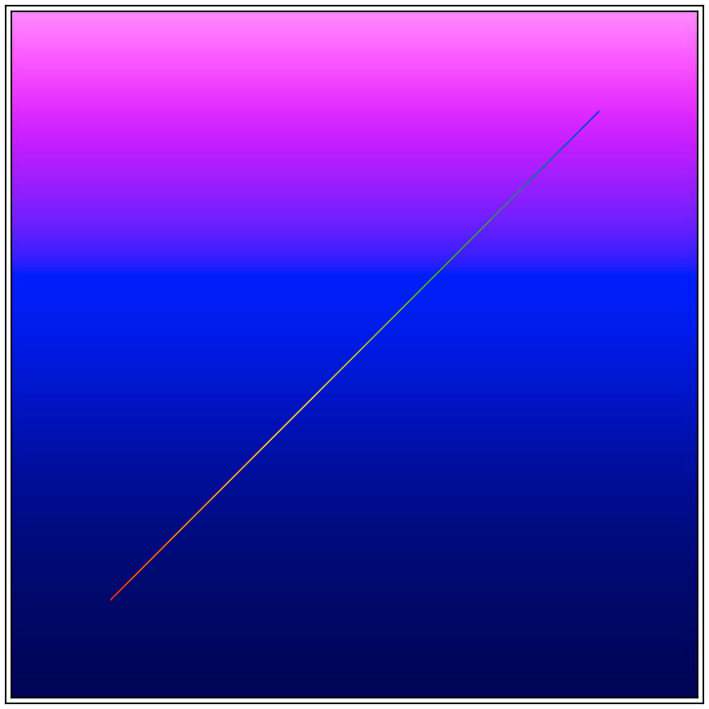
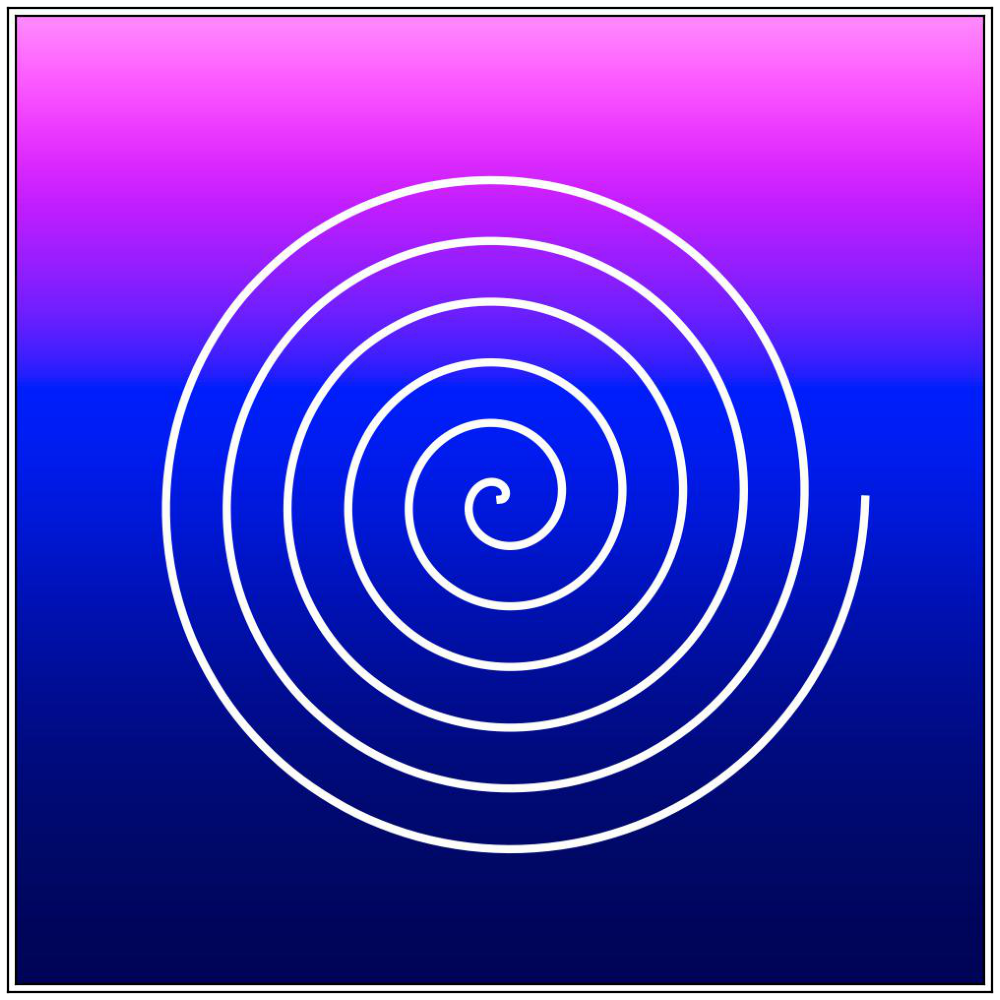
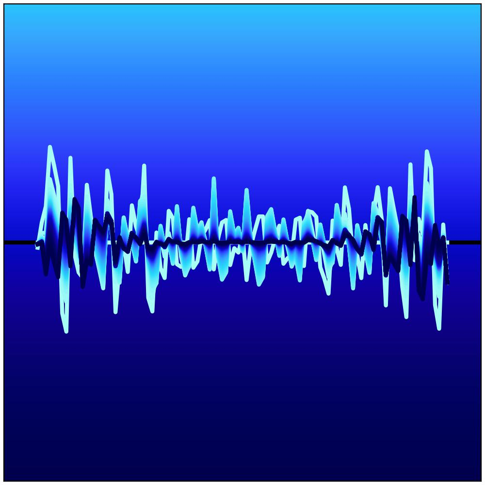

# Github profile pic
Under construction

[`spiral.py`](spiral.py) may be run using `python` with a conda environment created from [`conda-env.yml`](conda-env.yml):
```
conda env create -f conda-env.yml
```

## Timeline 
| Date: 18/3/23 |
| :---: |
| |
| Date: 25/3/23 |
| |
| Date: 14/4/23 |
| |
| Date: 15/4/23 |
| |
| Date: 9/6/23 |
| |
